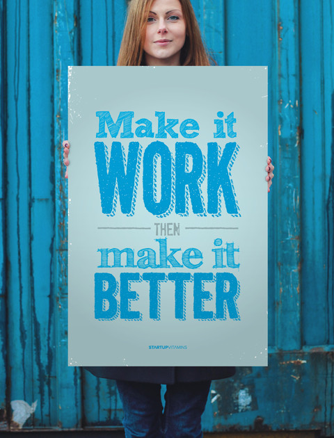

# 5. Feedback & Iteration

> Nothing is so perfect, that it cannot be improved.

## Ship. Revise. Kill. 

A Client typically has 3 options when reviewing work. Should the project be launched, “go live”, shown to the world? 

* “Ship It!” for 3 points: Project will be deployed to the world. Complete and met objectives in full. However, every project can benfit from added: time, budget, and resources -- this Design could be even better. Good job.
* “Revise It!” for 2 points: Project will not ship. Complete but did not meet objectives in full and not ready to launch. It may ship someday if revised.  
* “Kill It!” for 1 point: Project was attempted, but client is dissatisfied with overall work, objectives not met, and project will be terminated. A new/replacedment Designer will be hired. 

## A Good Start

Following are projects are good start can be shipped now. With a few revisions and/or code fixes, these Designs could be even better. 

* [Ellie Johnson](https://ejohnson24.github.io/movie-trailer/)
* [Meg Gilbert](https://meggilbert15.github.io/movie-trailer/)
* [Evan Olson](https://evan1079.github.io/movie-trailer/)
* [Lillian Ragudo](https://lragudo.github.io/movie-trailer/)
* [Anatoli Railean](https://toha87.github.io/movie-trailer/)
* [Erik Steward-Smith](https://erik1968.github.io/movie-trailer/)
* [Jacqueline Swanson](https://jacquelineswanson.github.io/movie-trailer/)
* [Nicole Welter](https://nicolewelter.github.io/movie-trailer/)

